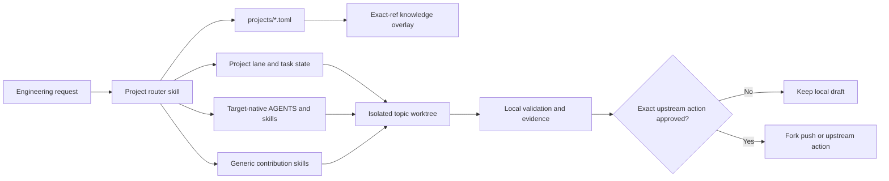

# Agent-Native Cloud Infrastructure Workstation

A skills-based engineering workstation for handling multiple open-source cloud infrastructure projects without mixing portfolio state, learning records, and upstream source branches.

The initial registry includes Karmada, AgentCube, and OpenSandbox. All three point to independent sibling repositories. OpenSandbox is connected as a read-only-upstream partial clone; no personal fork or upstream-facing action has been created.

## Architecture



The workstation is the coordination plane. Source repositories and per-task Git worktrees remain independent data planes.

## Quick Start

```bash
cd /home/agent-native-cloud-infra
./workstation list
./workstation status
./workstation doctor
./workstation context opensandbox
./workstation context-sync karmada agentcube
./workstation task-list
```

Create a research or design task without touching the source repository:

```bash
./workstation task-create opensandbox inspect-pool-lifecycle \
  --title "Inspect SandboxPool lifecycle" \
  --issue "https://github.com/opensandbox-group/OpenSandbox/issues/<id>"
./workstation task-status opensandbox inspect-pool-lifecycle researching
```

Create a source worktree only after the project clone and base ref exist:

```bash
./workstation task-create opensandbox fix-example \
  --title "Fix example" \
  --worktree \
  --branch fix/example \
  --base upstream/main
```

This creates `.worktrees/opensandbox/fix-example` and a separate task lane. It does not push, open an issue, or open a PR.

## Skills

- `route-project-work`: select the repository, load branch-independent project instructions, and isolate concurrent work.
- `onboard-open-source-project`: create or refresh a project adapter from current official sources and executable repository truth.
- `manage-upstream-contribution`: enforce freshness, branch, design, test, and exact-action publishing gates.
- `review-agent-native-infra`: review lifecycle, state, isolation, networking, credentials, multi-tenancy, observability, and release boundaries.

Target-native skills remain authoritative for target-specific operations. For example, OpenSandbox's runtime skills should be discovered from its CLI/repository rather than copied into this workstation.

## Command Reference

| Command | Purpose |
| --- | --- |
| `./workstation list [--json]` | List registered projects and domains. |
| `./workstation status [project...] [--json]` | Read local branch, dirty state, tracking, and sync counts. |
| `./workstation doctor [project...] [--context] [--json]` | Validate registration and optionally require current knowledge overlays. |
| `./workstation context <project> [--json]` | Show the complete lane, command, instruction, and native-skill context. |
| `./workstation context-sync [project...] [--json]` | Materialize ignored project knowledge overlays from clean matching worktrees or exact-ref snapshots. |
| `./workstation project-add ...` | Add a planned project profile without cloning or forking it. |
| `./workstation task-create ...` | Create structured task state and optionally an isolated worktree. |
| `./workstation task-status ...` | Move a task through the fixed lifecycle vocabulary. |
| `./workstation task-list [project...] [--json]` | List task state across projects. |

## Validation

Python 3.11 or newer is required. The repository checks are:

- `make test`: hermetic CLI, Git-worktree, whitespace-gate, and skill-lock unit tests in temporary repositories.
- `make validate-skills`: skill structure plus deterministic local checksums and validation metadata. Structure validation uses `$CODEX_HOME/skills/.system/skill-creator/scripts/quick_validate.py`.
- `make whitespace`: Git-compatible whitespace checks across tracked, staged, and untracked files, including an unborn repository.
- `./workstation doctor`: host integration checks for the registered sibling repositories, canonical remotes, read-only upstream push URLs, refs, instructions, lanes, and task state.
- `make check`: the complete local and host-integrated validation suite.

`doctor` intentionally depends on the sibling repository paths registered in `projects/*.toml`; the unit tests do not.

## Design Decisions

The Karmada and AgentCube `intern` branches proved the value of separating stable rules, short restart state, evidence, task inventory, and repeatable skills. They also exposed three scaling limits addressed here:

- Long-lived learning branches diverge from upstream and disappear from topic-branch context.
- Per-project copies of generic skills and scripts drift and retain hard-coded paths or repository names.
- Markdown alone is a poor task database when several projects and agents update status concurrently.

This repository therefore keeps one generic skill layer, machine-readable project/task state, branch-independent discovery of native project skills, and ignored per-task worktrees.

Project learning context is exposed through ignored `.context/projects/<id>/`
overlays. The registered Git ref and resolved commit are authoritative; links
are disposable navigation aids. A clean matching learning worktree is used
when available, while missing, dirty, or mismatched worktrees fall back to a
read-only snapshot containing only declared knowledge paths. See
[`docs/architecture/context-overlay.md`](docs/architecture/context-overlay.md).

The workstation's evolution and context-efficiency rules are defined in
[`docs/architecture/core-principles.md`](docs/architecture/core-principles.md).
Durable cross-project outcomes are indexed once per ISO week under
[`summaries/weekly/`](summaries/weekly/); daily and monthly rollups are
intentionally omitted.

## Next Project: OpenSandbox

The OpenSandbox lane records the canonical `opensandbox-group/OpenSandbox` repository, nested `AGENTS.md` model, monorepo validation tiers, six native runtime skills, and current contribution constraints. Its clean `main` checkout tracks a canonical `upstream` whose push URL is disabled. The next step is candidate selection and personal-fork setup, not another onboarding scaffold; see [the project profile](lanes/opensandbox/PROJECT.md) and its onboarding task.
