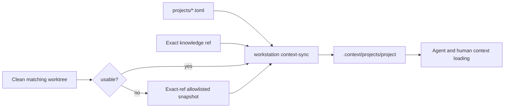

# Project Context Overlay

Observed at: 2026-07-21

## Problem

Karmada and AgentCube keep durable project learning on long-lived `intern`
branches. Their root instructions, short progress state, reports, and native
skills are absent from clean upstream topic branches. Karmada's current intern
worktree also lives under `/tmp`, so a direct committed link would break when
the host cleans temporary files.

The workstation registry already discovers root instructions and skills from a
learning ref, but it does not expose progress, report indexes, or a stable
browsable namespace. Copying the complete report trees into this repository
would duplicate ownership and make the coordination plane responsible for
tens of megabytes of project history.

## Design



The Git ref and resolved commit SHA are the source of truth. The ignored
overlay is generated state and can be deleted or rebuilt at any time.

Each project may declare:

- `knowledge.ref`: the exact local Git ref used for durable learning context;
- `knowledge.always_load`: small files that every routed work loop should read;
- `knowledge.mounts`: named links for instructions, progress, reports, and
  skills.

`context-sync` chooses a live worktree only when it checks out the configured
learning branch, has the same commit as the knowledge ref, and is clean. Every
other case uses a cached snapshot created with `git archive` from the exact
commit. The snapshot contains only declared paths.

The generated project overlay contains:

```text
.context/projects/<project>/
|-- source -> registered source repository
|-- intern -> selected worktree or exact-ref snapshot
|-- AGENTS.md -> intern/AGENTS.md
|-- PROGRESS.md -> intern/PROGRESS.md
|-- reports -> intern/internship-reports
|-- skills -> intern/.agents/skills
`-- context.json
```

`context.json` records the project, ref, SHA, source mode, source path, and
generation time. `workstation doctor --context` rejects missing, stale, or
broken overlays. Live worktree overlays continuously recheck branch, HEAD, and
clean state; a worktree that becomes dirty is stale on the next context check.
Per-project file locks serialize concurrent overlay rebuilds.

## Security And Ownership

- Overlay and cache directories must remain below the workstation root.
- Registry paths must be safe POSIX-relative paths and cannot expose `.git`.
- Snapshot extraction rejects traversal, escaping symlinks, and unsupported
  archive member types.
- Dirty learning worktrees are not loaded implicitly.
- The overlay does not change target repositories, branches, or remotes.
- Root `projects/` remains the TOML registry; linked repositories belong under
  `.context/projects/` to avoid mixing configuration and source ownership.

## Context Budget

Always-load files should remain small: root instructions, short progress, and
report indexes or TODO files. Reports and skill directories are mounted for
search and on-demand reading, not recursively injected into every prompt.
The doctor warns when always-load context exceeds six files or 256 KiB.

## Weekly History Index

The workstation owns one reviewed `summaries/weekly/YYYY-Www.md` index per ISO
week. It links durable outcomes to task evidence and exact upstream refs; it is
not injected into every project overlay. Daily and monthly indexes are omitted
to avoid duplicating the same state at three cadences.

Raw conversation transcripts must remain in an ignored,
permission-restricted archive. Only reviewed decisions, evidence, validation,
blockers, and next steps belong in Git.
