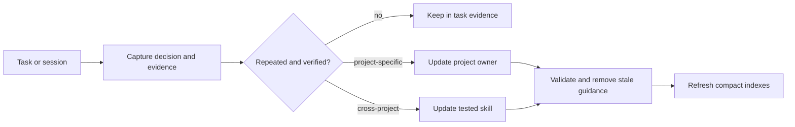

# Workstation Core Principles

Observed at: 2026-07-21

## Purpose

The workstation should improve from completed work without becoming a second
monorepo, a raw conversation dump, or an ever-growing prompt. Evolution is a
controlled promotion process, not automatic accumulation.

## Core Rules

1. **Exact source before memory.** Pin code and durable project knowledge to a
   repository, ref, and commit. Treat time-sensitive community state as an
   observation with a timestamp.
2. **Smallest sufficient context.** Load global rules, current project state,
   and task state first. Search indexes before opening reports. Read raw logs,
   benchmark data, images, and long histories only for a concrete question.
3. **One authoritative owner.** Source stays in target repositories, task state
   stays in lanes, reusable procedures stay in skills, and short cross-project
   restart state stays in root `PROGRESS.md`.
4. **Generated views are disposable.** Context overlays, caches, indexes, and
   rendered summaries must be reproducible from registered sources.
5. **Promotion requires repetition and evidence.** A one-off observation stays
   in task evidence. A verified recurring project rule moves to the project
   profile or project instructions. A reusable cross-project workflow moves to
   a workstation skill with tests.
6. **Replace before adding.** When evidence invalidates an existing rule,
   update or remove it in the same change. Do not preserve contradictory
   guidance for history; Git already provides history.
7. **Automation does not grant authority.** Self-evolution may propose, index,
   validate, and summarize. It may not push, comment, request review, publish,
   or change external systems without the applicable approval gate.

## Evolution Loop

## Efficiency Recommendations

- Keep always-load context below six files and 256 KiB per project.
- Keep root `PROGRESS.md` to active state, blockers, next actions, and stop
  conditions; archive detail in task evidence or project reports.
- Prefer filename/front-matter indexes plus `rg` over recursively reading report
  trees.
- Record one session summary per independent writer, then generate daily,
  weekly, and monthly views from those immutable summaries to avoid concurrent
  append conflicts.
- Track exact commands and validation results once; link them instead of
  copying the same chronology into progress, reports, and PR drafts.
- Add a helper or skill only when it removes repeated work or enforces a real
  safety boundary. Delete unused adapters and stale generated views.

## Session And Summary Boundary

Future `sessions/<id>/` records should contain reviewed metadata, decisions,
evidence links, validation, blockers, and next steps. Raw transcripts belong in
an ignored permission-restricted archive because they may contain secrets,
volatile logs, and redundant discussion. Daily, weekly, and monthly summaries
should be regenerated from curated session records and task state, with a
small human-owned section for interpretation.
