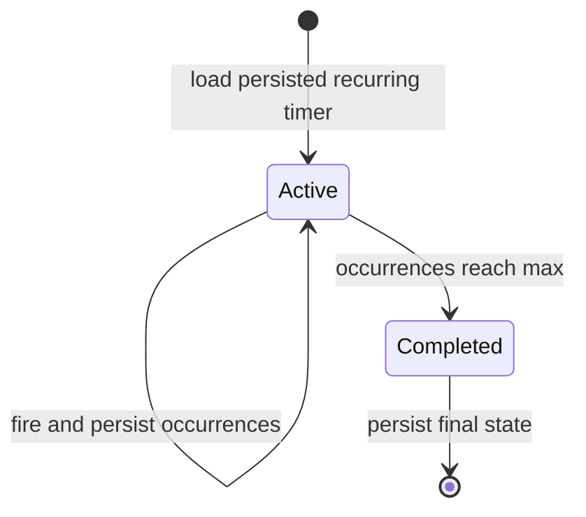

# Restore recurring timers after restart

## Problem

Persisted recurring timers have `interval_seconds` and `occurrences` but no
`expiry_time`. Reload and status paths treat every active timer as one-shot,
so one recurring record aborts all timer restoration and its status lookup.
Restarting also must preserve occurrence counts and completion limits.

## Scope

- Restore active recurring timers with their persisted occurrence count.
- Report recurring timer status without requiring `expiry_time`.
- Persist occurrence progress and the completed state when `max_occurrences`
  is reached.
- Add focused offline async regression tests for reload and lifecycle behavior.

## Non-Goals

- No MCP protocol, one-shot timer semantics, event-loop architecture, storage
  schema migration, or user-facing tool signature changes.

## File Matrix

| Area | Why | Risk | Validation |
| --- | --- | --- | --- |
| `src/timer_tools.py` | Restore the complete recurring lifecycle | Duplicate or excess callbacks after restart | Focused async lifecycle tests |
| Focused tests | Reproduce persistence and status failures without MCP/network | Timing flakes | Short intervals with bounded async waits and cleanup |

## Plan

1. Add type-aware restore and status handling.
2. Persist occurrence progress and terminal completion.
3. Add baseline/patch counterfactual tests and run the experiment test suite.

## Decision Log

- Base: `upstream/main@fd254a3f0ff2baebd9108695f477b58808fa53aa`.
- Merged PR #113 only moved restored tasks onto the MCP server event loop; it
  did not handle recurring timer records, status, or occurrence persistence.
- No open issue, PR, comment claim, or canonical branch overlaps this change as
  observed on 2026-07-23.
