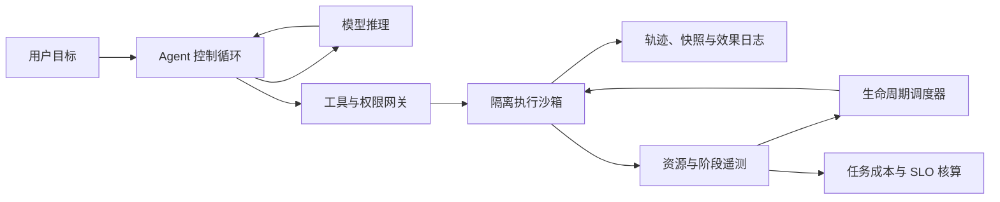
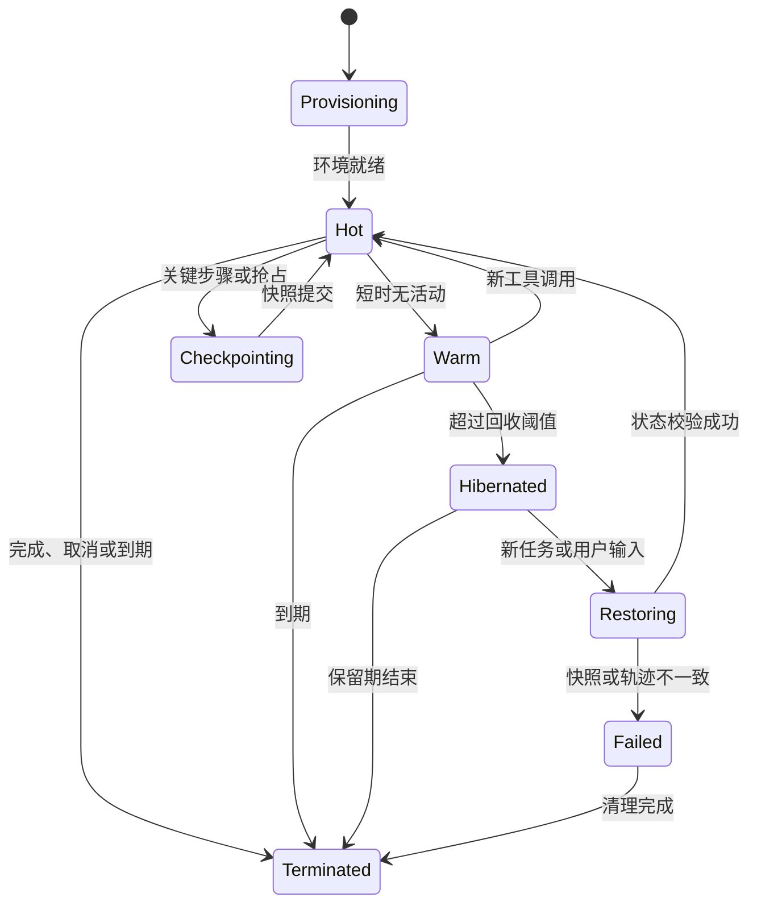

# 基于量化分析的 AI Agent 计算范式变革

> 从负载特征、基础设施瓶颈到 Agent Sandbox 设计路径

| 项目 | 内容 |
| --- | --- |
| 文档 ID | `agent-compute-paradigm` |
| 文档类型 | 技术分析报告 |
| 维护状态 | maintained |
| 原始材料日期 | 2026-06-30 |
| 整理日期 | 2026-07-24 |
| 证据截止时间 | 2026-07-24（Asia/Shanghai） |
| 适用范围 | 以代码执行型 Agent 和长程 Agent 为主，不直接外推至所有 Agent 工作负载 |

## 摘要

AI Agent 将计算入口从确定性的“执行指令”改为目标驱动的“自主规划与行动”。在代码执行型 Agent 的公开测量中，单任务持续数分钟，沙箱镜像达到 GB 级，操作系统与工具执行占端到端时延的主要部分，内存呈现低基线、高尖峰和强不确定性。这些特征同时冲击传统云基础设施关于平稳负载、历史可预测、无状态重试和中心化镜像分发的假设。

本报告将原始文章中的观点、公开研究、内部观测和场景推导分层整理。公开证据支持三个核心判断：内存而非 CPU 更可能成为并发瓶颈；工具调用驱动的秒级资源尖峰使历史均值和容器级静态限额不足；长程、有副作用的执行需要联合管理进程状态、文件状态和外部效果。工程上应从“调度容器”转向“调度 Agent 生命周期”，并建立可恢复状态、分层镜像供给、纵深隔离、任务级可观测性和按成功任务核算的成本模型。

## 1. 结论先行

1. **Agent 不是更长的 FaaS。** 在 AgentCgroup 的 144 个软件工程任务样本中，任务持续约 5–11 分钟，容器镜像范围为 2.9–17.3 GB，典型值约 3.5 GB；该测量边界不能无条件外推到浏览器 Agent、对话 Agent 或轻量函数 Agent。
2. **内存密度比平均 CPU 更能约束并发。** 公开研究观察到约 185 MB 的框架基线和最高 15.4× 的内存峰均比；低 CPU 不等于实例可被安全超卖，因为内存尖峰可能在 1–2 秒内出现。
3. **资源预测必须从“实例历史”下沉到“生命周期与工具阶段”。** 同一 Agent 在不同任务、不同运行和不同模型下的需求显著变化，单一容器 request/limit 和分钟级控制回路无法及时响应亚秒级突发。
4. **冷启动是计算、存储和网络的联合问题。** 大镜像、高周转和集中拉取会形成带宽压力，但原稿给出的 18.6 GB/s、14.56 GB/s 和 323 Tbps 无法由现有参数复算，不能作为已证实容量结论。
5. **长程 Agent 的容错单位是语义进度，不是进程。** 恢复必须同时考虑模型轨迹、进程内存、文件系统和外部副作用；单纯重启容器可能重复非幂等操作或丢失已经完成的工作。
6. **安全隔离不能阻止 Prompt 注入。** VM、容器、沙箱和策略引擎的作用是限制注入后的权限、网络、文件和凭据影响面；输入可信度、工具授权和执行隔离必须分别治理。
7. **优化目标应从资源利用率升级为任务效率。** 冷启动、密度和 CPU 利用率都是局部指标，平台最终应围绕成功任务成本、任务完成时间、恢复成功率和副作用正确性做权衡。

## 2. 证据与方法

### 2.1 证据分级

| 等级 | 类型 | 本报告中的使用方式 |
| --- | --- | --- |
| E1 | 可访问的一手公开论文或官方技术报告 | 支撑公开负载特征、系统设计和论文测量结果 |
| E2 | 原稿记录的内部线上观测 | 保留为内部观察，不视为可独立复现结论 |
| E3 | 基于明确输入的场景计算 | 给出公式、单位和假设，允许复算 |
| E4 | 架构判断或工程建议 | 明确标为推论，需要通过原型和基准验证 |

### 2.2 主要证据

- **E1：AgentCgroup。** 论文在单机环境中测量 144 个 SWE-rebench 软件工程任务，覆盖两个模型；本文采用其任务时长、镜像规模、OS 执行占比、内存基线、峰均比和不确定性结论。该论文截至证据截止时间是 arXiv 预印本，不应标注为“OSDI 2025”。
- **E1：DeltaBox。** 论文提出联合文件系统与进程状态的增量 checkpoint/rollback，并在其 SWE-bench 与 RL 微基准环境中报告毫秒级结果；这些数字是特定原型和测试环境结果，不代表所有生产沙箱都能达到相同延迟。
- **待核引用：DeepSeek-V4 DSec。** 原稿引用其轨迹日志和抢占恢复设计；DeepSeek 官方发布页仍存在，但发布页所链接的技术报告 PDF 在证据截止时间返回 404，当前模型仓库文件清单也不含该 PDF。因此本报告不使用 DSec 细节支撑已确认结论。
- **E2：原稿内部观测。** Codex、OpenClaw 和约 5 万实例的线上指标没有随原稿附带采样窗口、硬件、版本、聚合口径或原始数据，因此仅作为待复核的工程信号。
- **E3：镜像带宽场景。** 本报告重新给出公式并指出原稿算式缺口，不把无法复算的结果继续当作事实。

### 2.3 适用性限制

- AgentCgroup 测量的是容器化软件工程 Agent，不能直接代表常驻聊天 Agent、多模态桌面 Agent、边缘 Agent 或纯 API 编排 Agent。
- 内部观测缺少可审计数据集，本报告不能验证其统计显著性、测量偏差或跨版本稳定性。
- 基础设施收益依赖镜像缓存命中率、任务到达分布、租户隔离等级、恢复语义和 SLO；不存在脱离场景的统一最优方案。

## 3. Agent 负载画像

### 3.1 从指令执行到目标驱动

传统函数或服务通常接收结构化输入并执行预定义逻辑。Agent 接收目标后，会反复进行意图理解、步骤规划、模型推理、工具选择、环境执行、结果审视和策略修正。循环次数、工具类型和副作用均可能在运行时变化，因此任务边界和资源需求不再由入口参数完全决定。

### 3.2 公开测量画像

| 维度 | AgentCgroup 样本观察 | 基础设施含义 |
| --- | --- | --- |
| 单任务时长 | 约 5–11 分钟，整体中位数约 8.1 分钟 | 沙箱会持续占用内存和状态，不能按瞬时函数处理 |
| 容器镜像 | 2.9–17.3 GB，典型值约 3.5 GB | 启动受镜像准备、层映射、缓存和存储路径影响 |
| 时延组成 | OS 与工具执行约占端到端时延的 56%–74% | 只优化模型推理不能消除主要系统开销 |
| 内存基线 | 框架基线约 185 MB | 即使工具空闲，长驻实例也存在不可忽略的常驻成本 |
| 内存突发 | 峰均比最高 15.4×，极端样本峰值约 4060 MB、均值约 264 MB | 按均值分配会产生 OOM 风险，按峰值预留会浪费容量 |
| 突发时长 | 典型资源突发约 1–2 秒 | 分钟级 HPA/VPA 或用户态控制回路可能反应过慢 |
| 需求差异 | 跨任务、运行和模型可出现数量级差异 | 历史曲线只能提供先验，不能直接决定单任务配额 |

### 3.3 内部观测信号

| 对象 | 原稿记录 | 当前证据状态 |
| --- | --- | --- |
| Codex | CPU P50 2.171%，Private Memory 均值 1200 MiB | 待补采样窗口、版本、主机配置、进程口径和原始数据 |
| OpenClaw | CPU P50 0.700%，RSS 均值 521 MiB | 待补实例分布、会话活跃定义和容器开销口径 |
| Codex 活跃度 | 5204 个采样分钟中，会话事件 435 分钟、工具调用 342 分钟、token 活动 363 分钟 | 比例可由原稿数字复算，但样本选择和并发口径未知 |
| 长程 OpenClaw | 超过 5 万实例，平均 CPU 利用率 0.53%，内存利用率 11.4% | 需要脱敏后的时间范围、实例规格分布、分母和聚合算法 |

这些内部数据共同指向“低 CPU、持续内存、短时突发”的候选画像，但在原始观测材料归档前，不应将其表述为跨平台规律。

### 3.4 与传统负载的差异

| 维度 | FaaS | 微服务 | 软件工程 Agent |
| --- | --- | --- | --- |
| 执行边界 | 单请求或单函数 | 长期服务进程 | 多轮模型与工具循环 |
| 任务时长 | 通常为毫秒至秒 | 长期运行 | AgentCgroup 样本为 5–11 分钟 |
| 状态 | 倾向外置或无状态 | 主要外置 | 轨迹、进程、文件和外部副作用并存 |
| 资源模式 | 短峰值 | 相对平稳或有周期 | 静默与突发交替，且阶段动态变化 |
| 失败恢复 | 重试请求 | 重启并重连外部状态 | 需要避免重复副作用并恢复语义进度 |
| 主要调度信号 | 请求率和并发 | CPU、内存、延迟 | 生命周期、工具阶段、状态成本、资源水位和任务 SLO |

## 4. 五类基础设施挑战

### 4.1 内存密度与脉冲式负载

在仅考虑物理内存的理想上界中，节点并发可粗略表示为：

`N_max <= (M_node - M_system - M_cache_reserve) / M_instance_peak`

若节点有 128 GB 内存，单实例峰值为 2–4 GB，则忽略系统、缓存、碎片和安全余量时只能得到 32–64 个实例的理论上界。生产容量必须进一步扣除运行时、页缓存、内核、守护进程和故障冗余，不能直接用该上界承诺并发。

15.4× 峰均比意味着平台不能在“按峰值预留”和“按均值超卖”之间二选一，而需要组合使用分阶段配额、内核级快速约束、可回收内存、受控超配和明确的降级路径。任何超配策略都必须测量 OOM、尾延迟和相邻租户干扰，而不只是平均利用率。

### 4.2 资源需求不可预测

Agent 的不确定性来自目标差异、模型决策、工具选择、输入仓库、依赖安装和失败重试。历史数据仍可用于建立任务类别先验，但不能把同一镜像或同一 Agent 名称视为稳定资源类别。

建议将资源控制拆成三级：准入时使用任务类型、租户 SLO 和安全等级设定初始预算；运行时根据推理、工具执行、等待和恢复阶段调整可回收资源；内核或运行时在突发窗口执行亚秒级保护。预测模型必须输出置信度和失败路径，不能只有单点 request 值。

### 4.3 镜像分发与物理带宽

原稿场景给出每台服务器 1000 个沙箱、每个镜像 3.5 GB、平均寿命 8 分钟、共 10000 台服务器。若进一步假设每个新实例都完整拉取镜像、生命周期均匀替换且无缓存、去重或压缩，则平均镜像入口带宽为：

`B_host = 1000 * 3.5 GB / (8 * 60 s) = 7.29 GB/s`

`B_global = 7.29 GB/s * 10000 = 72.9 TB/s = 583 Tbps`

这个结果是极端假设下的平均上界模型，不是生产预测。原稿中的单机 18.6 GB/s、EVS 14.56 GB/s 和全局 40.4 TB/s（323 Tbps）无法由现有输入同时复算，说明还缺少启动窗口、读写放大、层命中率、压缩率或并发系数。补齐参数前，应删除“超过物理极限 116%”等确定性判断。

正确的工程方向仍然成立：通过内容寻址层、节点预热、P2P 或分层分发、按需加载、共享只读层和本地快照降低重复传输；但收益必须以缓存命中率、首字节延迟、实际读取字节和故障回源流量验证。

### 4.4 长程 Agent 的低利用率与整理困难

长程 Agent 可能长时间等待用户、模型或外部系统，同时保留内存、文件和连接。简单休眠能够回收 CPU，却未必回收全部内存或允许跨机整理；永久不结束的沙箱还会形成碎片和版本滞留。

平台需要显式区分 Hot、Warm、Hibernated 和 Terminated，并为每次状态迁移定义可恢复内容、唤醒 SLO、存储成本和最大保留时间。用户付费模型应尽量映射可解释的资源维度，如 CPU-second、GiB-second、持久化 GB-day、网络字节和恢复次数，再聚合为“每个成功任务成本”；“智力密度”只有在可测量定义出现后才适合作为计费概念。

### 4.5 长程状态、外部副作用与容错

Agent 执行可能修改文件、提交代码、调用 API、发送消息或创建云资源。只恢复进程内存会遗漏外部效果，只恢复文件系统会丢失模型轨迹和打开的运行时状态，只重放轨迹则可能重复非幂等副作用。

因此恢复协议至少需要三类原语：Checkpoint 保存进程与文件状态；Trajectory Log 记录模型、命令和工具结果以支持快速前滚；Effect Log 为外部副作用记录幂等键、提交状态和补偿操作。DeltaBox 展示了增量文件与进程 checkpoint/rollback 的一种实现；轨迹日志与基础设施快照如何建立一致性边界，仍需公开可核材料和生产实验支撑。

## 5. 从传统计算到 Agent 原生基础设施

| 传统范式 | Agent 原生转变 | 最小工程能力 | 关键验证指标 |
| --- | --- | --- | --- |
| 调度进程或容器 | 调度任务与 Agent 生命周期 | 阶段识别、配额调整、热池与休眠 | 成功任务率、排队时间、阶段误判率、OOM 率 |
| 进程重启 | 语义级恢复 | checkpoint、trajectory log、effect log、幂等协议 | 恢复时间、恢复成功率、重复副作用数、状态偏差 |
| 黑盒资源隔离 | 执行层虚拟化与纵深防御 | VM/容器边界、最小权限、网络策略、凭据代理 | 越权率、逃逸面、策略拒绝、凭据暴露和审计覆盖率 |
| 中心化完整镜像拉取 | 分层、预热、共享与按需加载 | 内容寻址、节点缓存、懒加载、回源控制 | 实际拉取字节、缓存命中率、冷启动 P95/P99、回源峰值 |
| 同构单体执行 | 模型、控制流、工具和沙箱解耦 | 明确协议、背压、超时、取消和状态所有权 | 端到端关键路径、跨组件流量、部分失败恢复率 |
| 只看吞吐 | 优化串行关键路径和尾延迟 | 阶段 tracing、批量/并发策略、快速工具启动 | 任务完成时间 P50/P95/P99、Reason-Act 周期分布 |
| 按配置或实例时长计费 | 按可解释用量和成功任务核算 | 资源计量、租户归因、失败成本分类 | 单成功任务成本、闲置占比、恢复成本、计费误差 |
| 静态 IAM | 人、Agent、模型、工具和工作负载联合身份 | 委托链、短期凭据、能力令牌、审批与审计 | 未授权调用、令牌作用域、委托可追踪性、撤销时延 |

### 5.1 调度：生命周期感知而非“读懂意图”

调度器不需要理解自然语言语义本身，而需要消费可验证的运行信号：任务类别、工具阶段、资源水位、等待原因、状态大小、恢复成本和 SLO。把“理解 Agent 意图”作为调度前提既难以验证，也会把模型不确定性扩散到资源控制面。

### 5.2 隔离：约束影响面而非承诺消除攻击

独立 Guest OS、容器、用户命名空间、seccomp 和 cgroup 提供不同层级的执行隔离，但都不能从根源上阻止恶意上下文诱导 Agent 调用已授权工具。安全设计必须同时覆盖输入与内容信任、工具能力授权、网络出口、文件路径、凭据注入、租户身份和完整审计。

### 5.3 性能：优化端到端串行关键路径

“Agent 生活在纳秒级世界”不是可操作的工程表述。Agent 的 Reason-Act 链路通常跨越模型推理、RPC、进程调度、工具执行和存储访问，真正需要控制的是每一阶段的 P50/P95/P99 及其串行累积。微秒级调度优化只有在端到端 profile 证明其位于关键路径时才应优先。

## 6. 平台设计框架

### 6.1 生命周期状态机

每条迁移必须定义触发条件、状态所有者、幂等键、超时、取消、存储保留和孤儿清理。Hot/Warm/Cold 不能只由 CPU 阈值决定，否则模型等待、网络阻塞和异常卡死会被误判为可休眠。

### 6.2 资源控制面

- **准入层：** 根据租户、任务类别、镜像、工具集合、状态等级和 SLO 分配初始预算，并拒绝无法满足隔离或容量约束的任务。
- **运行层：** 暴露推理、工具执行、等待、checkpoint 和 restore 阶段；允许受控扩容、内存回收和阶段化限额。
- **保护层：** 在亚秒级突发下执行内核或运行时限流，提供 OOM 前信号、优先级和可诊断的终止原因。
- **整理层：** 通过可恢复状态迁移和最大寿命处理节点碎片、版本升级和故障域重平衡。

### 6.3 状态与副作用

- **进程状态：** 内存、线程、文件描述符和运行时上下文。
- **文件状态：** 工作区、依赖、缓存和工具产物；应区分只读基础层、共享缓存层和租户可写层。
- **模型轨迹：** 输入、模型版本、采样配置、工具请求与结果；记录必须满足隐私和保留策略。
- **外部效果：** API 调用、消息、提交和资源创建；必须有幂等键、提交协议或补偿动作。
- **一致性点：** checkpoint、轨迹位置和 effect log 提交位点需要同一恢复令牌，否则“恢复成功”可能只是局部状态成功。

### 6.4 网络与存储

- 镜像和依赖采用内容寻址，避免同一字节重复传输。
- 对高命中基础层做节点级或机架级预热，对低命中层使用按需加载并限制回源并发。
- 将用户工作区、工具缓存和 checkpoint 分开计量与保留，避免大规模快照复制完整基础镜像。
- 将镜像启动流量、任务业务流量、模型 RPC 和恢复流量分别观测，防止总带宽掩盖单一链路热点。
- 设计降级路径：缓存失效、对象存储限流、节点丢失和跨可用区恢复都必须有明确 SLO。

### 6.5 安全与多租户

- 将 Agent 视为受委托但不完全可信的主体，模型输出不得自动继承用户全部权限。
- 使用短期、最小作用域凭据，并由可信代理在调用点注入；禁止把长期密钥写入镜像、Prompt、轨迹或 checkpoint。
- 网络出口采用域名/IP 绑定、DNS 重绑定防护、代理信任边界和审计；高风险工具默认拒绝。
- 文件系统挂载必须验证规范化路径、符号链接、所有权和读写范围。
- 隔离等级应与任务风险匹配：轻量进程隔离适合低风险代码片段，处理不可信代码、宿主凭据或多租户数据时需要更强边界。

## 7. 评价体系：从局部指标到任务结果

原稿提出“平台奥运会、沙箱经济学、Agent 竞速赛”三个维度。整理后可将其定义为一套分层评价体系。

### 7.1 平台奥运会：能力与极限

| 类别 | 建议指标 |
| --- | --- |
| 创建 | 单实例启动 P50/P95/P99、批量创建吞吐、成功率、镜像准备占比 |
| 密度 | 每节点可用实例数、内存安全余量、页缓存复用、相邻租户干扰 |
| 生命周期 | Hot/Warm/Hibernated 转换时延、误判率、唤醒失败率、孤儿率 |
| 恢复 | checkpoint/restore 时延、状态大小、恢复一致性、重复副作用数 |
| 安全 | 隔离逃逸测试、策略覆盖率、凭据暴露、未授权出口和审计完整性 |

### 7.2 沙箱经济学：成本与利用率

| 类别 | 建议指标 |
| --- | --- |
| 资源 | CPU-second、GiB-second、GPU-second、网络字节、存储 GB-day |
| 浪费 | 等待资源占比、无效重试成本、过期快照、低命中缓存和空闲保留成本 |
| 单位经济性 | 每成功任务成本、每恢复任务成本、每租户毛利和 SLO 违约成本 |
| 超配安全 | OOM 率、尾延迟恶化、受害租户数、回收命中率和紧急迁移率 |

### 7.3 Agent 竞速赛：用户结果

| 类别 | 建议指标 |
| --- | --- |
| 完成 | 任务成功率、端到端完成时间、首次有效结果时间 |
| 质量 | 回归测试通过率、错误副作用数、人工返工率 |
| 稳定 | 取消成功率、超时率、恢复后结果一致性 |
| 可解释 | 每阶段耗时、工具失败原因、资源瓶颈和成本归因覆盖率 |

微基准只能解释局部能力。平台优化必须最终证明成功任务成本下降、完成时间缩短或安全边界增强，否则启动时间和密度数字可能只是把成本转移到恢复、网络或尾延迟。

## 8. 待补证与验证计划

| 优先级 | 待补内容 | 当前风险 | 建议验证 |
| --- | --- | --- | --- |
| P0 | 原稿网络/存储场景中的 18.6 GB/s、14.56 GB/s、40.4 TB/s 推导参数 | 关键结论不可复算 | 补充启动窗口、缓存命中、压缩、读写放大和并发分布后重算 |
| P0 | Codex/OpenClaw 内部观测原始数据和口径 | 可能把单一版本或主机特征外推为通用规律 | 归档脱敏数据、采样器版本、硬件、聚合 SQL 和置信区间 |
| P0 | 超过 5 万 OpenClaw 实例的 0.53% CPU、11.4% 内存利用率 | 分母、规格和时间窗口未知 | 按实例规格、租户、活跃状态和时间段分层，报告分位数而非单一均值 |
| P1 | “同一任务 1.8× 方差”定义 | 方差没有倍数单位，表述不可解释 | 明确是峰值比、变异系数、方差比还是运行间最大/最小值 |
| P1 | 休眠可回收 613 MiB/实例和 56.71% Cold 候选时间 | 缺少阈值、误判和唤醒成本 | 做阈值扫描，联合报告回收量、唤醒 P99、误判率和任务影响 |
| P1 | 镜像分层和预热收益 | 容易只测理想缓存路径 | 同时测试冷缓存、热缓存、缓存击穿、节点故障和跨区回源 |
| P1 | 语义恢复协议 | 单一快照无法覆盖外部副作用 | 构造非幂等工具、部分提交、进程崩溃和存储故障矩阵 |
| P2 | “按智力密度计费” | 目前不可测量且难以向用户解释 | 先以可审计资源量和每成功任务成本建立基线 |

## 9. 工程实施顺序

1. **先建立可观测基线。** 对模型、工具、沙箱、网络、checkpoint 和等待阶段统一 trace，并关联任务、租户、镜像、模型版本和结果状态。
2. **再解决内存安全。** 建立峰值分布、OOM 前信号、阶段化预算和受控超配，先证明不会以尾延迟和租户干扰换取平均密度。
3. **优化镜像供给链。** 量化实际读取字节和缓存命中，按基础层、依赖层和工作区拆分，再选择预热、共享、P2P 或懒加载。
4. **定义恢复契约。** 明确 checkpoint、轨迹和 effect log 的一致性令牌，覆盖取消、超时、重试、抢占和部分失败。
5. **实现生命周期调度。** 在 Hot/Warm/Hibernated 间迁移，并设置最大寿命和清理机制；不要把 CPU 阈值等同于语义空闲。
6. **最后调整计费。** 先用可审计资源维度解释账单，再引入每成功任务成本和 SLO，不直接使用未定义的抽象指标。

## 10. 总结

Agent 基础设施的变化不是把容器启动再加速一个数量级，也不是把单节点密度推到某个固定数字。真正的范式变化在于：计算单元从可预测进程变成动态任务循环，状态从外置业务数据扩展到模型轨迹、进程、文件和外部效果，资源控制从静态实例配置转向生命周期阶段和任务结果。

公开测量已经足以证明传统静态资源模型存在明显错配，但还不足以证明所有 Agent 都需要同一种运行时或调度器。下一阶段应以可复现测量为基础，围绕内存安全、镜像供给、语义恢复、纵深隔离和成功任务成本逐层验证。只有当局部优化能稳定改善端到端任务结果，Agent 原生基础设施才从观点转化为工程能力。

## 参考资料

1. Yusheng Zheng et al., [AgentCgroup: Understanding and Controlling OS Resources of AI Agents](https://arxiv.org/abs/2602.09345v3), arXiv:2602.09345v3, 2026.
2. Yunpeng Dong et al., [DeltaBox: Scaling Stateful AI Agents with Millisecond-Level Sandbox Checkpoint/Rollback](https://arxiv.org/abs/2605.22781v2), arXiv:2605.22781v2, 2026.
3. DeepSeek-AI, [DeepSeek V4 预览版发布页](https://api-docs.deepseek.com/zh-cn/news/news260424/), 2026；页面链接的技术报告 PDF 在 2026-07-24 核查时不可访问，DSec 相关陈述未作为已确认结论。
4. 《面向 Agent 资源效率的研究：休眠唤醒、行为模式与云平台调度超配的初步分析》，原稿引用的内部材料，当前仓库未归档，待补可审计版本。
